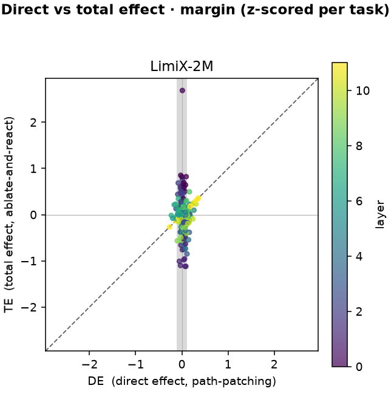

# tfm_lens

**Tabular foundation models do not repair themselves.**
Ablating a layer barely moves the output — but the recovery is passive redundancy, not active compensation.



One point is one (layer, task).

- **Below the diagonal** = self-repair: direct damage undone downstream.
- **Grey stripe** (`|DE| ≈ 0`) = redundancy: the layer wrote nothing to undo.

The mass sits in the stripe. Same picture in all four models tested — LimiX-2M, Mitra, TabICLv2, TabFM.

## What this measures

Ablation alone gives one number, and one number cannot tell repair from redundancy. So measure two:

- **TE** — total effect. Ablate layer *m*, let everything downstream react, read the output.
- **DE** — direct effect. Ablate layer *m*, hold everything downstream at its clean value ([path patching](src/tfm_lens/evaluation/path_patching.py)).
- **CE = DE − TE** — what downstream made up. **Self-repair ⟺ CE > 0, consistently.**
- Both read through the model's **own** decoder, so the two rulers share one basis.

DE is computed in **one** forward pass, not one per layer: the residual stream is additive, so freezing the downstream is arithmetic.

```
r_L^DE(m) = r_L^clean − a_m + ã_m
```

A test pins this shortcut against a real frozen-downstream forward, across 3D / 4D / double-stream layouts.

## Relation to Balef et al.

Re-examines the self-repair claim of *Is One Layer Enough?* ([arXiv:2605.06510](https://arxiv.org/abs/2605.06510), ICML 2026).

**Reproduced** ([`balef_exp6.py`](src/tfm_lens/evaluation/balef_exp6.py)):

- Skip a layer, decode every depth: performance dips, then recovers.
- Early layers are the exception — their ablation never recovers.
- Holds in all four models.

**Where we differ** — their criterion for calling that recovery *self-repair*:

- It moves the **measurement** (read at every depth), not the **intervention**.
- Every reading is still a total effect; the ablation propagates freely downstream at each one.
- A trajectory of total effects, however finely sampled, never yields a direct effect.
- Measured on ROC-AUC, which is rank-based and ceiling-blind — dips visible in a margin coordinate do not move it at all.

## Reproduce

```bash
uv sync --group eval --group viz

# 1. per-layer decoders (the paper's Exp4) — the one asset that costs GPU
uv run python -m tfm_lens.finetune --config configs/limix_2m.yaml --model limix_2m

# 2. the trajectory experiment — dip and recovery
uv run python scripts/run_balef_exp6_sweep.py --model limix_2m --ablation resample
uv run python scripts/plot_balef_exp6_trajectory.py --model limix_2m --metric margin

# 3. direct + total effect
uv run python scripts/run_path_patching_sweep.py --model limix_2m --out out/de_limix_2m.json
uv run python scripts/plot_de_te_scatter.py --models limix_2m --coord margin
```

Data: 15 TabArena binary-classification tasks, pulled from OpenML ([task ids](src/tfm_lens/evaluation/datasets.py)).

**Ablation is `resample`, not zero.** Zeroing a layer's contribution collapses the residual norm and puts the model off-manifold, so the "repair" could be an artifact of a broken input. `resample` substitutes a role-matched contribution from a real donor table — label token for label token, query row for query row — leaving upstream intact and downstream free to react.

## How the library is built

Everything runs through one primitive:

```
frozen forward → capture per-layer residual → [intervention] → decode
```

- **Model-specific code lives only in [`adapters/`](src/tfm_lens/adapters/).** Each adapter answers: where are the layers, how to run a frozen forward, what does a skipped layer return, how does a raw layer output become decoder-ready (`readout`).
- Core uses plain PyTorch forward hooks. No model-source surgery, no third-party lens library.
- Four backbones, three residual layouts: 3D single-stream (TabICL, TabFM), 4D (LimiX), double-stream (Mitra).
- Upstream model code and preprocessing are vendored **byte-for-byte** under `vendor/`; the forward pass is ours, because per-layer capture and layer ablation need it.
- Modules are named after the **method**, never a conclusion — `path_patching`, not `direct_effect`; `balef_exp6`, not `self_repair`.

See [`DESIGN.md`](DESIGN.md) for the full design.

## Read more

- Write-up: [Do tabular foundation models repair themselves?](https://xiaohan2012.github.io/articles/tfm-self-repair/)
- Video: [5-minute overview](https://www.youtube.com/watch?v=2eV-px6EWXQ)
- Prior work: McGrath et al., [The Hydra Effect](https://arxiv.org/abs/2307.15771) — where CE and the compensation law come from.

## Development

```bash
uv sync                 # .venv + deps + dev group
uv run pytest           # tests
uv run ruff check .     # lint
uv run ruff format .    # format
pre-commit install      # git hooks
```
