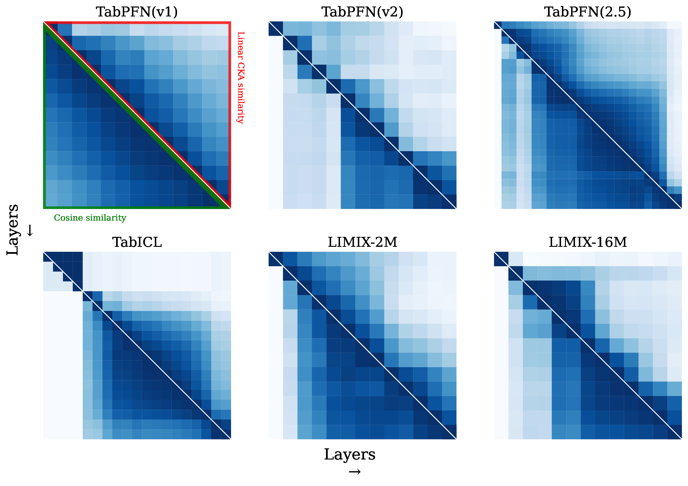
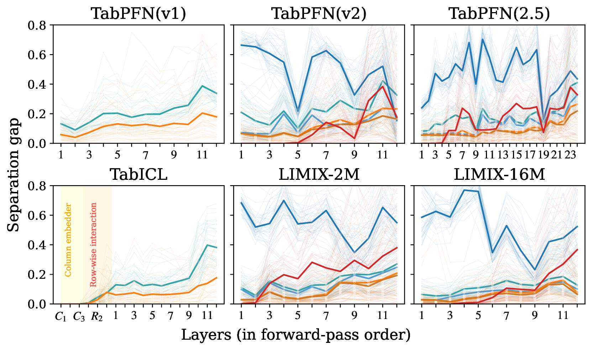
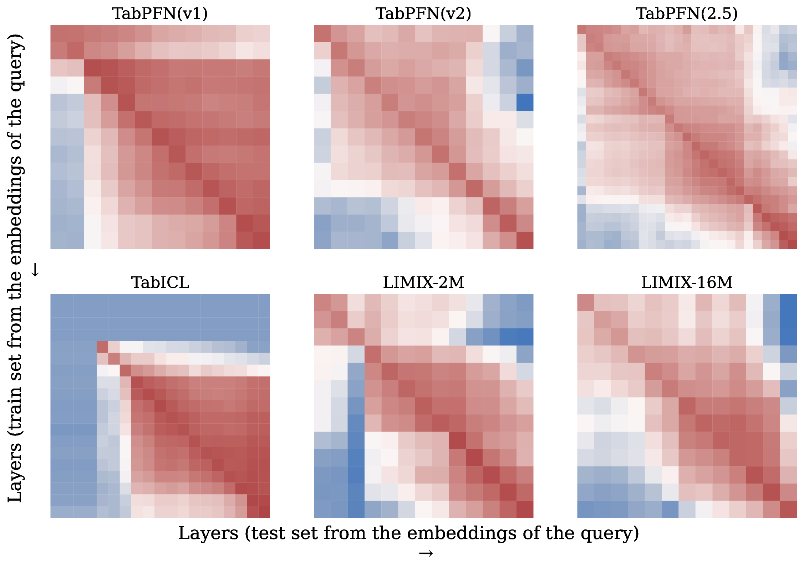
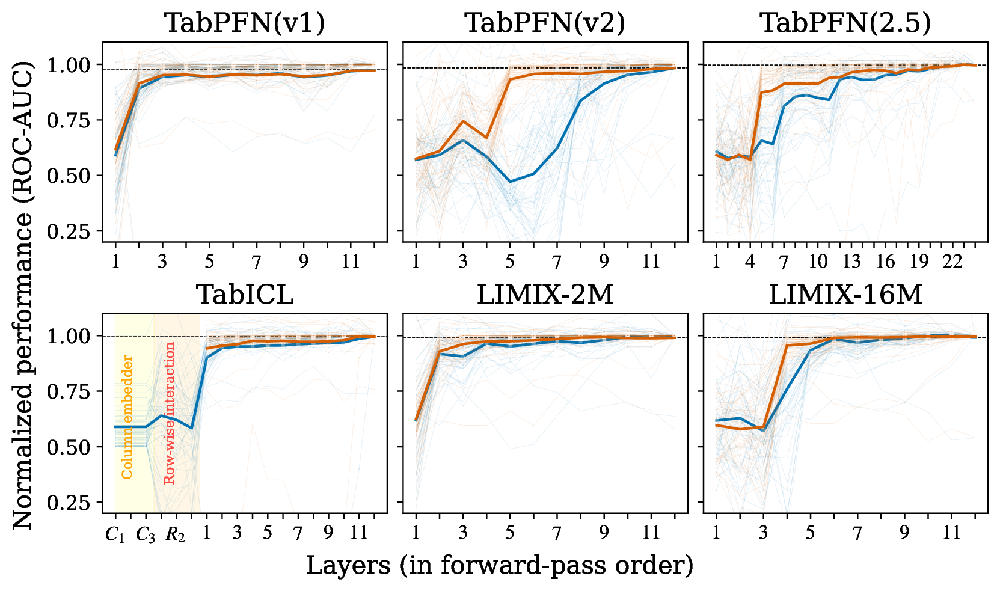
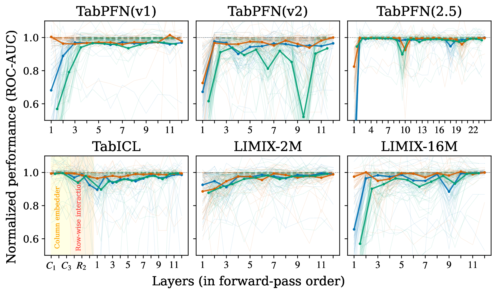
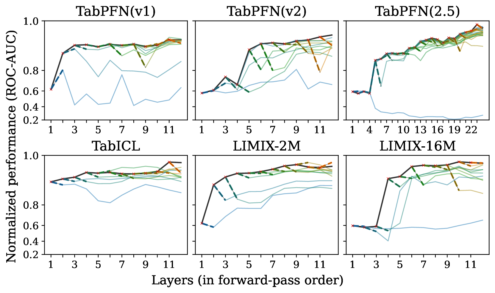

# Is One Layer Enough? Understanding Inference Dynamics in Tabular Foundation Models

**Source:** https://arxiv.org/abs/2605.06510
**Title:** Is One Layer Enough? Understanding Inference Dynamics in Tabular Foundation Models
**Date ingested:** 2026-05-25
**Type:** paper
**Authors:** Amir Rezaei Balef, Mykhailo Koshil, Katharina Eggensperger
**Venue:** ICML 2026
**Code:** https://github.com/amirbalef/is_one_layer_enough

## Summary

An early mechanistic-interpretability study of tabular foundation models (TFMs), contemporaneous with [bilos2026mechanistic](bilos2026mechanistic.md) (which instead pins down each model's *readout mechanism* and its adversarial failure surface). Three questions, three answers:

- **Q1 — How does inference unfold across depth in a TFM?**
    - **Iterative refinement.** Predictions form in the first few layers; later layers add features without overwriting.
    - **Depth-redundant but active.** Middle/late skips are self-repaired downstream; the first layer is the only unrecoverable one.
- **Q2 — Do LLM mechanistic findings transfer to TFMs?**
    - **Partially.** Shared shape: early-critical, block-structured representations, forward-only probe transfer.
    - Diverges from LLMs in three ways: more middle-layer redundancy, less final-layer importance, much higher swap sensitivity (TFMs are order-specialized).
- **Follow-up — Is one layer enough?**
    - **A single looped block matches a 6-layer stack** at matched compute, licensing recurrent / shallow-depth TFM architectures.

**Models studied.** TabPFN v1, TabPFN v2, TabPFN(2.5), TabICL, LIMIX-2M, LIMIX-16M — all encoder-only, set-invariant TFMs.
**Benchmarks.** 15 binary-classification tasks from TabArena (≤10K samples, ≤100 features) and 34 small tasks from PMLBmini (≤500 samples).

## RQ1: How does inference unfold across depth in TFMs?

i.e. as a data point flows through the layers, where and how is the prediction gradually built up? Tackled with six layer-wise experiments that fall into three families.

### Experiments

| Family                     | Experiment                            | Question it answers                                                                       |
| -------------------------- | ------------------------------------- | ----------------------------------------------------------------------------------------- |
| A. Look at representations | Embedding similarity                  | Do adjacent layers share a representation space (redundant blocks)?                       |
|                            | Separation gap                        | Does the layer pull classes further apart than the previous one?                          |
| B. Decode representations  | Probing classifiers                   | Is the label linearly decodable here, and are features cumulative or replaced?            |
|                            | Tabular logit lens                    | At what depth is the prediction effectively formed?                                       |
| C. Causal intervention     | Layer ablation (skip / repeat / swap) | Is each layer necessary, reusable, and position-specific?                                 |
|                            | Self-repair                           | Do downstream layers recover a skipped layer's computation (redundancy vs active repair)? |

The three families form a ladder of evidence: **observe → read out → intervene**. A says *what's there*, B says *what can be extracted*, C says *what is causally required* — each rung stronger than the last.

### A. Look at the representations (no intervention)

- **1. Embedding similarity** — pairwise cosine + CKA over per-token hidden states, layer × layer heatmap. See [representation-similarity](representation-similarity.md) for the metrics.
    - **Paper-specific application:** averaged over all tokens (support + query, all features), then over datasets.

    

    **Takeaway 1:** TFMs often form blocks in which the embeddings remain similar. *Upper triangle: linear CKA; lower triangle: cosine.*
- **2. Separation gap** — track how cleanly the model pulls classes apart layer by layer.
    - **Formula:** with $h_\ell(x_i)$ the layer-$\ell$ embedding, $y_i$ its label, and pair sets $\mathcal{P}^{\text{within}}_\ell = \{(x_i,x_j) : y_i = y_j\}$, $\mathcal{P}^{\text{between}}_\ell = \{(x_i,x_j) : y_i \neq y_j\}$:
        $$D^{\text{within}}_\ell = \tfrac{1}{|\mathcal{P}^{\text{within}}_\ell|} \sum_{(x_i,x_j) \in \mathcal{P}^{\text{within}}_\ell} d(h_\ell(x_i), h_\ell(x_j))$$
        $$D^{\text{between}}_\ell = \tfrac{1}{|\mathcal{P}^{\text{between}}_\ell|} \sum_{(x_i,x_j) \in \mathcal{P}^{\text{between}}_\ell} d(h_\ell(x_i), h_\ell(x_j))$$
        $$\boxed{\Delta_\ell = D^{\text{between}}_\ell - D^{\text{within}}_\ell}$$
    - **Defaults:** $d =$ cosine distance; 100 within + 100 between pairs sampled per dataset; PCA at 95% variance applied first to control noise in the high-dim residual stream.
    - **Computed separately** for support vs query, and for per-cell models also feature vs label embeddings — exposes the "features form first, labels follow" pattern.

    

    **Takeaway 2:** TFMs incrementally increase the distance between samples from different classes. *Bold lines: dataset average; thin lines: individual datasets; label embedding lags feature embedding.*

### B. Decode the representations (read out without changing the model)

- **3. Probing classifiers** — logistic-regression probes per layer + cross-layer transfer matrix. See [probing-classifier](probing-classifier.md) for the technique.
    - **Paper-specific setup:** query embeddings only (support tokens leak labels); query split in half for train + validation.
    - **Signature finding:** red upper triangle ($j > i$ works) + blue lower triangle ($j < i$ fails) → each layer **adds** features without overwriting earlier ones (cumulative residual-stream enrichment).

    

    **Takeaway 3:** Each layer cumulatively enriches the representation by adding new features while preserving previous ones. *Y-axis: train layer; X-axis: test layer; color: normalized ROC-AUC.*

> **Note — reading the asymmetry correctly.** The cumulative-feature claim relies on **long-range** off-diagonal asymmetry, not short-range. Two patterns coexist in the same heatmap:
>
> - **Short-range, symmetric:** diagonal-aligned red blocks (e.g. layers 4-9 all transferring to each other in both directions) — adjacent layers hold near-identical representations, so probes transfer within a block. This is **block redundancy** bleeding through from Experiment 1, *not* the cumulative-feature signal.
> - **Long-range, asymmetric:** compare a far off-diagonal pair like cell $(1, 11)$ vs its mirror $(11, 1)$ — probe trained on layer 1 tested on layer 11 stays warmer than the reverse. This mirrored-pair contrast is the actual cumulative-feature signature.
>
> The paper's "consistent though model-dependent" qualifier reflects this: TabICL and TabPFN v1 show clean long-range asymmetry; TabPFN(2.5), LIMIX-16M show it weakly through block structure; TabPFN v2 is the noisiest. The visually dominant block structure can mask the long-range asymmetry on first glance.

- **4. Tabular Logit Lens** — per-layer decoders trained on TabICL-prior synthetic data; emit a real prediction at every depth. Introduced by this paper; see [tabular-logit-lens](tabular-logit-lens.md) for the full technique.
    - **Finding:** AUC rises sharply in the first few layers for all six TFMs; the per-layer-decoder vs original-decoder gap defines the **prediction-ensembling** stage.

    

    **Takeaway 4:** Representations are already formed for a reliable prediction in the early layers, but not necessarily aligned with the original decoder. *Orange: per-layer decoder; blue: original final decoder; the gap marks the prediction-ensembling stage.*

#### Probe vs lens — when to use which

| Aspect | Probe (Exp 3) | Lens (Exp 4) |
|---|---|---|
| **Intuitive idea** | External classifier on frozen layer | Model emits a prediction *as if* this were the final layer |
| **Asks** | Is the label encoded here? (information-theoretic) | Would the model emit the label here? (functional) |
| **Unique power** | Cross-layer transfer ($i \to j$) → distinguish cumulative vs replaced features | Real prediction in the model's output space → defines the *prediction-ensembling* gap vs the original decoder |

The **gap between them** is itself the diagnostic: where the info is encoded but not yet aligned with the model's own decoder — a finding neither tool delivers alone.

### C. Intervene on the layers (causal tests)

- **5. Layer ablation** — skip / repeat / swap interventions on the forward pass; the first **causal** evidence in the experiment ladder. See [layer-ablation](layer-ablation.md) for the technique.
    - **Findings:**
        - **Skip:** early layers (especially the first) catastrophic; middle/late mostly safe. Exception: **TabICL and LIMIX-2M** survive early skips — their upstream encoders (row-wise interaction; RBF preprocessing) already perform the *latent-mapping* role.
        - **Repeat:** helps **LIMIX-16M** and **TabPFN v1** — direct empirical seed for the [looped-transformer](looped-transformer-tfm.md) follow-up.
        - **Swap:** universally hurts; sensitivity is greater than in LLMs, especially in **TabPFN v2** → TFMs are far more order-specialized than LLMs.

    

    **Takeaway 5:** Early layers contribute the most, while later layers perform iterative refinement of the representation. *TabICL and LIMIX-2M robust to early skips; swaps universally hurt; repeats help LIMIX-16M and TabPFN v1.*
- **6. Self-repair** — lens-after-skip trajectory disambiguates Exp 5's "skip OK" between pure redundancy and active recovery. See [self-repair](self-repair.md) for the technique.
    - **Finding:** early-layer skips show **no recovery** (first layer = unique functionality); middle/late skips show **clear recovery**, especially in TabPFN v2 → middle/late depth-redundancy is real and active, not merely unused.

    

    **Takeaway 6:** Self-repair generally occurs after layer ablations, except for the first layer. *Solid black: no-skip baseline; colored lines: post-skip trajectories, crosses mark the skipped layer; dashed line connects post-skip dip to baseline.*

### How the six combine to answer RQ1

- **A (what's there):** separation grows monotonically; block structure in deep models.
- **B (when it's formed):** probe and lens saturate early; features transfer forward, not backward.
- **C (what's required):** early layers crucial, middle/late skippable but actively self-repairing, swaps universally hurt.
- **→ Iterative inference.** Predictions form early; later layers refine via overlapping (not distinct) computations — depth is largely redundant, motivating the looped-block follow-up.

## Relation to Prior Work

- **LLM mechanistic interpretability** (logit lens, tuned lens, probing classifiers, layer ablation): provides the toolbox; this paper ports the toolbox to TFMs and re-discovers shared structure (early-critical, block-redundant) plus TFM-specific deviations (more middle redundancy, more swap sensitivity).
- **[tabpfnv1](hollmann2023tabpfnv1.md), [tabpfnv2](hollmann2025tabpfnv2.md), [tabicl](qu2025tabicl.md), TabPFN(2.5), LIMIX-2M/16M:** all six are treated as black-box subjects of analysis. The paper does not propose a new TFM; it diagnoses where each one's depth is or is not contributing.
- **Looped transformers:** the layer-repeat experiment provides the empirical seed; the looped-nanoTabPFN follow-up is the constructive proof-of-concept. See [looped-transformer-tfm](looped-transformer-tfm.md).
- **Tuned lens (Belrose 2023) / logit lens (nostalgebraist 2020):** the [tabular-logit-lens](tabular-logit-lens.md) adapts the idea to TFMs by continue-pretraining a fresh decoder per layer on TabICL priors, since TFM final decoders are too tightly tied to the final-layer basis to be reused directly.

## Entities & Concepts

- [probing-classifier](probing-classifier.md) — generic technique used in Exp 3
- [representation-similarity](representation-similarity.md) — generic technique used in Exp 1
- [layer-ablation](layer-ablation.md) — generic technique used in Exp 5
- [self-repair](self-repair.md) — generic concept used in Exp 6
- [tabular-logit-lens](tabular-logit-lens.md) — per-layer decoders introduced by this paper (Exp 4)
- [looped-transformer-tfm](looped-transformer-tfm.md) — recurrent single-block TFM design
- [tfm-inference-stages](tfm-inference-stages.md) — four-stage TFM inference taxonomy
- [tabular-learning](tabular-learning.md) — TFM family context
- [ferrando2024primer](ferrando2024primer.md) — LLM mech-interp survey; bridge table maps balef techniques to the broader landscape
- [bilos2026mechanistic](bilos2026mechanistic.md) — contemporaneous cross-TFM mechanistic study; identifies readout mechanisms (vote vs. prototype), symmetry edits, and mechanism-grounded attacks
- [gupta2026tabpfnheads](gupta2026tabpfnheads.md) — contemporaneous causal probe of TabPFN-2.5's attention heads; echoes the early-critical / distributed-elsewhere theme at head granularity
- [hollmann2023tabpfnv1](hollmann2023tabpfnv1.md), [hollmann2025tabpfnv2](hollmann2025tabpfnv2.md), [qu2025tabicl](qu2025tabicl.md), [qu2026tabiclv2](qu2026tabiclv2.md), [muller2022pfn](muller2022pfn.md)
