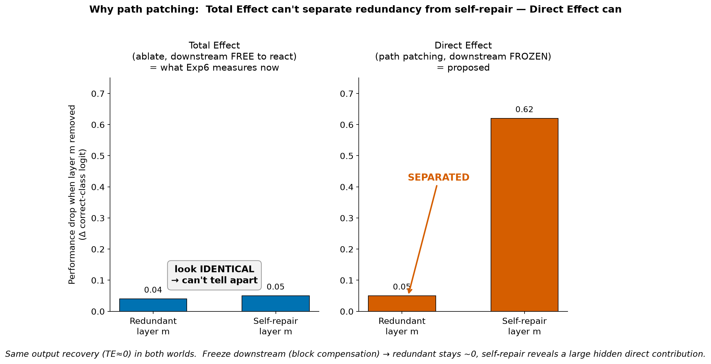

# Self-repair in Tabular Foundation Models — background & plan

Context for anyone picking up a self-repair issue (#34–#37). Defines the terms (TE / DE / IE, logit lens, path patching, …) and the dependency map. Read this first.

## 1. What & why

- **Goal:** transfer **self-repair** mechanistic-interpretability techniques from LLMs to Tabular Foundation Models (TFMs).
- **Concretely:** reproduce and extend Exp6 of Balef et al., *Is One Layer Enough?*, replacing the paper's logit-lens-only measure with a faithful causal-effect analysis.
- **Audience:** a session taking any of #34–#37 — for the shared vocabulary and the plan.

## 2. Source paper — Balef et al., *Is One Layer Enough?*

- **Exp4 — tabular logit lens.** Per layer, fine-tune a copy of the model's decoder (a nonlinear MLP, Linear-GELU-Linear) on the synthetic prior, then decode each layer → per-layer AUC. Measures *when* the answer becomes decodable.
- **Exp6 — self-repair (Figure 8).** Skip one layer at a time; read the per-layer trajectory. A drop-then-recover = self-repair.
- **A9 caveat.** The fine-tuned decoder is trained on synthetic-prior data; transfer to real tables is not validated.

## 3. Reproduction & the open question

We reproduced Figure 8 across **LimiX-2M, TabICLv2, Mitra, TabFM** (`evaluation/self_repair.py`, `scripts/plot_self_repair*.py`).

- **Observation.** Removing a mid-late layer changes the final output by ~0 → **total effect ≈ 0**.
- **The trap.** "Removed, output unchanged" has two explanations that look identical:
  - **redundant** — the layer wrote nothing.
  - **self-repair** — the layer wrote something important; downstream compensated.
- **Open question.** Which one? A total-effect-only plot cannot tell them apart.



## 4. Framework — Hydra effect (McGrath et al. 2023)

Treat the network as a causal graph and decompose the effect of ablating a layer:

```
TE = DE + IE
```

- **TE (total effect)** — ablate the layer, downstream free to react. What Exp6 measures.
- **DE (direct effect)** — the layer's own contribution, downstream frozen at clean.
- **IE (indirect effect)** — the part routed through downstream. `IE = TE − DE`.
- **CE (compensatory effect)** — how much downstream refills. `CE = −IE`.

Self-repair signature: `DE` large but `TE ≈ 0` → `IE` strongly negative (downstream refilled ≈ `DE`).


Why this resolves the open question:

- `DE ≈ 0` → **redundant**.
- `DE ≫ 0` (with `TE ≈ 0`) → **self-repair**.

Quantify across tasks: regress `CE` on `DE` → `R²` (how systematic) and slope (how complete the compensation is).

## 5. Glossary

- **TFM** — tabular foundation model; an in-context learner over a table.
- **row / feature axes** — TFM attention runs over two axes: across samples (rows / in-context) and across features (columns). Both are permutation-invariant.
- **self-repair** — downstream components compensate for an ablated one, so the output barely changes.
- **TE / DE / IE / CE** — see §4.
- **logit lens** — read a layer's contribution through the frozen linear unembed. In an LLM this is the layer's direct effect, for free.
- **tabular logit lens** — Balef's per-layer *fine-tuned nonlinear* decoder. A decodability probe, not a contribution meter.
- **tuned lens** (Belrose et al. 2023) — learned affine translator + frozen shared linear unembed. A linear belief-tracker.
- **CBE** — causal basis extraction; validates that the directions a lens relies on are causally used by the model. Optional here (path-patching DE supersedes it for the mechanism claim).
- **δ-level ablation** — replace a layer's *contribution* δ (what it writes to the residual), upstream intact. Skip sets `δ:=0`; resample sets `δ:=` a donor's.
- **resample vs zero ablation** — zero/skip pushes activations off-distribution and drops the residual norm (LayerNorm artifact); resample replaces with a real donor activation → on-distribution.
- **path patching** — freeze downstream at clean so only the direct edge `a→y` is live → measures DE on the real output.

## 6. Methodological stance

- **logit, not AUC** (#34) — AUC is a saturating rank metric; `TE = DE + IE` only holds in additive logit space.
- **resample, not zero** (#35) — on-distribution; avoids the LayerNorm self-repair artifact.
- **path-patching DE, not the lens** (#37) — faithful, on the real output; separates redundant from self-repair.
- **decoder validation** (#36) — fixed 200 steps, no val → fit unknown.
- **CBE optional** — only needed if we keep leaning on the lens for the decodability story.

## 7. Roadmap — RQ2 (not yet an issue)

Beyond redundant-vs-repair, a TFM-only question: **which axis compensates?**

- Does the repair come from other **rows** or other **features**?
- Along which axis is the redundancy distributed?
- LLMs can't ask this (single sequence axis); tabular's two axes make it a distinct contribution.
- Drives the donor-source choice in #35 (cross-row vs cross-feature).

## 8. Issue map

| # | Title | Role | Depends on |
|---|---|---|---|
| #34 | GT-logit y-axis | swap the ruler | — |
| #35 | resample ablation | swap the ablation | — |
| #36 | decoder validation | instrument robustness | — |
| #37 | path-patching DE | **the key measurement** | #34, #35 |

RQ2 (row / feature axis) — future; uses #35's donor sources.
